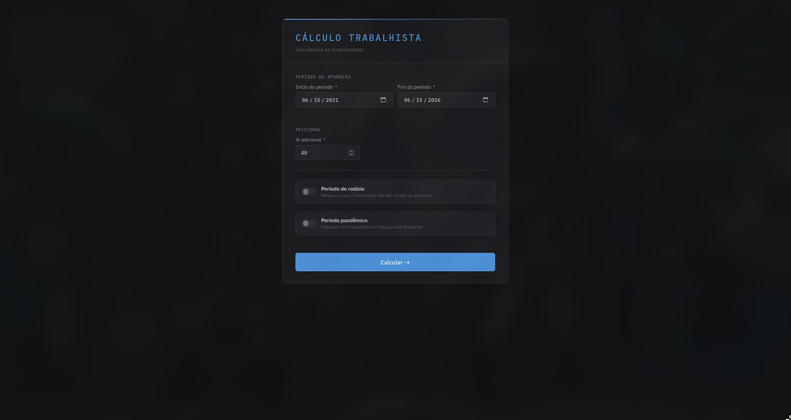
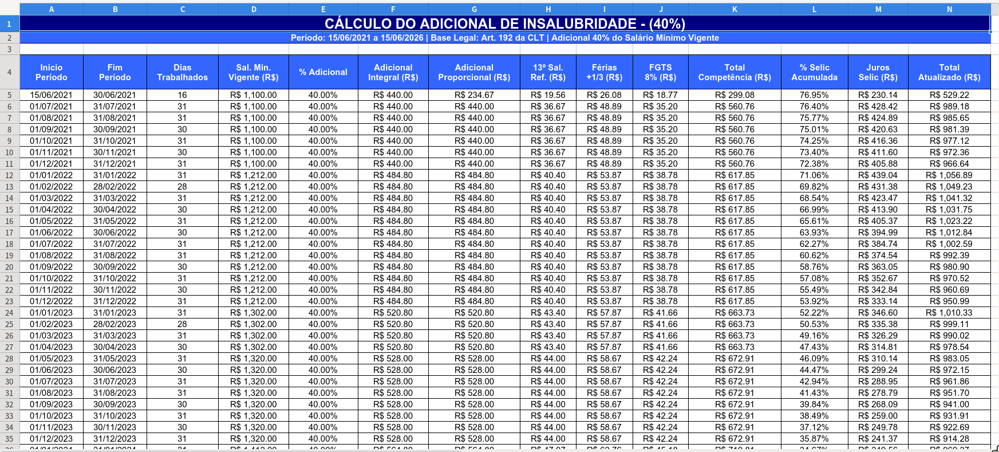
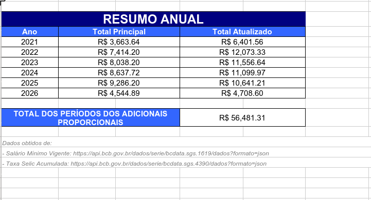

# Calculadora de Adicional Trabalhista

Calcula o adicional de insalubridade proporcional mês a mês ao longo de um vínculo, corrige cada competência pela Selic e entrega o resultado numa planilha `.xlsx` organizada por ano. É o tipo de cálculo que vai anexado a um processo trabalhista.

O projeto não é grande, e não tenta ser. A questão é outra: num número que entra num processo, errar não custa retrabalho, custa credibilidade. Tudo aqui foi construído em torno de uma prioridade só, **correção e auditabilidade acima de velocidade**.

## O problema

A conta é uma regra de domínio bagunçada. O adicional incide sobre o salário mínimo vigente, que muda de ano para ano. Sobre ele entram os reflexos: 13º proporcional, férias mais um terço, FGTS. Alguns meses não contam, por rodízio de turno ou por período de pandemia. E cada competência ainda precisa ser corrigida pela Selic acumulada até o fim do período. Feito na mão, em planilha, isso consome de um a dois dias, e um arredondamento errado no meio do caminho passa batido.

A ideia foi virar essa regra em software determinístico. Mesma entrada, mesma saída, sempre, com cada número rastreável até a origem.

## O que isso já fez de concreto

Foi validado no primeiro caso real e trocou um processo manual de um a dois dias por um cálculo que termina em minutos. Esse é o único resultado que afirmo. Não tem métrica de volume, adoção por equipe nem benchmark, porque não aconteceu.

## Decisões de engenharia

### Dado financeiro faltando: falhar alto, nunca preencher com zero

É o ponto técnico que mais me importa no projeto.

Salário mínimo e Selic vêm da API de séries temporais do Banco Central. Uma API externa pode devolver a série com buraco, uma competência ausente no meio do período. A reação ingênua é tratar o mês faltante como zero e seguir. Num cálculo que vai para um processo, esse é o pior resultado possível: um número errado com cara de certo, sem nenhum sinal de que está errado.

A aplicação faz o contrário. Antes de calcular qualquer coisa, ela varre o período mês a mês e exige que as duas séries cubram cada competência. Faltou uma, ela para e aponta qual:

```java
private void validateSeriesCoverPeriod(SettlementInput input,
    Map<YearMonth, BigDecimal> wageMap, Map<YearMonth, BigDecimal> selicMap) {

    YearMonth current = YearMonth.from(input.startDate());
    YearMonth end = YearMonth.from(input.endDate());

    while (!current.isAfter(end)) {
        if (!wageMap.containsKey(current) || !selicMap.containsKey(current))
            throw new IncompleteSeriesException(current);

        current = current.plusMonths(1);
    }
}
```

A decisão é deliberada. Uma falha que grita "faltou 2024-05" vale mais que um total silenciosamente errado. Cálculo que falha alto é confiável. Cálculo que corrige no escuro não é. O comportamento está preso em teste (`shouldThrowIncompleteSeriesExceptionWhenMonthIsMissing`).

### BigDecimal no domínio inteiro, dinheiro nunca como `double`

Toda a aritmética monetária usa `BigDecimal`, com `RoundingMode.HALF_UP` explícito em cada divisão. Não existe `double` no caminho do cálculo. Valores só viram `double` num ponto, na hora de escrever a célula da planilha pelo Apache POI, depois que o número já fechou. O erro de ponto flutuante clássico, o `0.1 + 0.2`, não tem por onde entrar no resultado.

### Validação determinística com cenários fixos

A confiança no cálculo não vem de "rodei e pareceu certo". Vem de um conjunto de cenários com a saída correta esperada, conferida coluna a coluna.

O arquivo [`valid_results.csv`](src/test/resources/service/valid_results.csv) guarda um caso por linha: período, salário, percentual e o valor esperado de cada parcela, do adicional integral ao total atualizado pela Selic. Um teste parametrizado (`@CsvFileSource`) roda o serviço contra cada linha e compara as quatorze colunas. Mudou a regra de cálculo e errou um centavo em qualquer cenário, o build cai.

### Clean Architecture, dependência apontando para dentro

As camadas são explícitas e a dependência sempre aponta para o domínio.

- **`domain`** é o coração. `SettlementCalculatorService` é Java puro, sem uma anotação de framework. Não sabe que Spring existe, não sabe que HTTP existe, não sabe o que é uma planilha. Recebe os dados de que precisa e devolve o resultado.
- **`application`** são os casos de uso (`CalculateLaborSettlementUseCase`, `GenerateReportUseCase`). Orquestram o domínio e dependem de interfaces, nunca de implementação concreta.
- **`infrastructure`** são os detalhes: os clients do Bacen, o gerador de planilha, a fiação de beans.
- **`presentation`** são os controllers REST, os DTOs, o mapeamento de entrada.

O domínio não importa nada das camadas de fora. Quem depende de quem se lê pelos imports.

### Gateway Pattern, o domínio não sabe que o Bacen existe

O acesso ao Banco Central fica atrás de portas declaradas no domínio:

```java
public interface MinimumWageGateway {
    List<MinimumWage> getMinimumWageHistory(LocalDate startDate, LocalDate endDate);
}
```

A implementação (`BacenMinimumWageApiClient`, `BacenSelicApiClient`) mora na infraestrutura e lida com `HttpClient`, parsing de JSON, formato de data. O domínio recebe `List<MinimumWage>` e `List<SelicRate>`, e pronto. Trocar a fonte, outra API, um cache, um arquivo, não encosta numa linha de regra de negócio.

O gerador de relatório segue a mesma ideia. A porta `ReportGeneratorPort` expõe `supports(format)` e `generate(...)`, e o caso de uso escolhe a implementação pelo formato pedido. Hoje existe o gerador de planilha. Somar um de PDF é implementar a porta, sem tocar no resto.

### Tratamento de erro padronizado, sem vazar detalhe interno

Um `@RestControllerAdvice` central traduz exceção em resposta HTTP consistente (`ApiErrorResponse`: timestamp, status, erro, mensagem, caminho). Violação de regra de negócio vira 400. Falha ao buscar dado do Bacen vira 502. Falha inesperada vira 500 com mensagem genérica, e o stack trace fica no log, não na resposta. A `IncompleteSeriesException` cai nesse mesmo handler e devolve **502 (Bad Gateway)** com a competência faltante na mensagem. O motivo exato, qual mês, chega a quem está usando, em vez de um erro genérico.

## Como rodar

Pré-requisito: **Java 21**. O Maven Wrapper acompanha o projeto.

```bash
# build + testes
./mvnw clean package

# executar
java -jar target/labor-settlement-calculator-0.0.1-SNAPSHOT.jar
```

A aplicação sobe, abre o navegador sozinha em `http://localhost:8080` e mostra uma janelinha de controle para encerrar o processo. Em ambiente sem interface gráfica, ela detecta o headless e segue só como API.

No formulário você preenche o período de apuração e o percentual (10 a 40), e se for o caso liga **rodízio** (meses sem direito ao adicional, num ciclo) ou **período de pandemia** (intervalo desconsiderado). Ao calcular, o navegador baixa a planilha `.xlsx` formatada, uma linha por competência, resumo por ano e rodapé citando as séries do Banco Central. Salário mínimo e Selic saem direto da API do Bacen pelas datas. Não tem tabela para atualizar na mão.

A interface estática (`src/main/resources/static`) valida a entrada no próprio navegador antes de enviar.

## A conta, em resumo

Para cada mês do período, o serviço:

1. pega o salário mínimo vigente na competência;
2. calcula o adicional integral (`salário × percentual`) e, se o mês for parcial, o proporcional aos dias trabalhados;
3. tira os reflexos sobre o proporcional, 13º (`/12`), férias mais um terço, FGTS (8%);
4. soma o total da competência;
5. acumula a Selic de forma composta da competência até o fim do período e aplica como correção.

Mês dentro de rodízio ou pandemia entra no resultado marcado, sem valor calculado, para a planilha mostrar o período inteiro sem fingir que aquele mês gerou adicional. No fim, os meses se agrupam por ano, com total principal e atualizado.

## Testes

```bash
./mvnw test
```

39 testes, todos passando. A cobertura mira no que pode dar errado num cálculo:

- **`SettlementCalculatorServiceTest`**, os 28 cenários do CSV conferidos coluna a coluna, mais rodízio, pandemia e série incompleta.
- **`CalculateLaborSettlementUseCaseTest`**, com Mockito, garante a reação do caso de uso quando o gateway devolve dado vazio.
- **`GenerateReportUseCaseTest`**, resultado vazio, formato não suportado e falha de geração.
- **`SpreadsheetReportGeneratorAdapterTest`**, seleção de formato pela porta.

## Stack

- Java 21
- Spring Boot 4.0.6 (web, actuator, validation)
- springdoc-openapi 2.5.0 (Swagger UI da API)
- Apache POI 5.2.4 (geração do `.xlsx`)
- Lombok (boilerplate de modelos e logging)
- `java.net.http.HttpClient` para a integração com o Bacen
- JUnit 5 + Mockito
- Maven (wrapper incluído)

## Estrutura

```
src/main/java/com/deathz/laborcalc
├── domain
│   ├── model        # SettlementInput, SettlementResult, MonthlyCompetenceDetail, ...
│   ├── service      # SettlementCalculatorService, a calculadora, Java puro
│   ├── ports        # MinimumWageGateway, SelicGateway, ReportGeneratorPort
│   ├── enums        # ReportFormat
│   └── exceptions   # IncompleteSeriesException
├── application
│   ├── usecases     # CalculateLaborSettlementUseCase, GenerateReportUseCase
│   └── exceptions   # BusinessRule, ExternalServiceNoDataFound, ReportGeneration (+ enums)
├── infrastructure
│   ├── client       # clients da API do Banco Central
│   ├── generator    # SpreadsheetReportGeneratorAdapter (Apache POI)
│   └── config       # fiação de beans
└── presentation
    ├── controllers  # SettlementController, GlobalExceptionHandler
    ├── dto
    └── mapper
```

## Demonstração

Formulário de entrada, com período, percentual e os controles de rodízio e período pandêmico:



Planilha gerada, uma linha por competência com todas as parcelas e a correção pela Selic:



Resumo por ano, com total principal e atualizado e o rodapé citando as séries do Banco Central:

